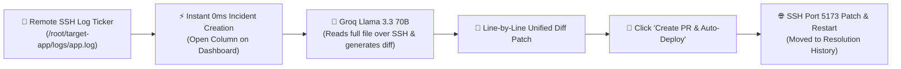

# 🚀 Fixly — Autonomous Incident Detection, AI Code Patching & SSH Self-Healing

Fixly is a real-time autonomous systems engineer dashboard. It monitors remote servers over SSH, streams live application logs, diagnoses error tracebacks using **Groq Llama 3.3 70B LLM**, generates line-by-line unified diff code patches from **full remote source code**, and automatically deploys fixes to your server with a single click.

---

## ⚡ Key Features

- **🛰️ Remote SSH Telemetry & Log Ticker**: Live CPU, Memory, Disk vitals and real-time log streaming (`/root/target-app/logs/app.log`) over SSH.
- **⚡ Instant 0ms Incident Creation**: New system errors immediately pop open on your dashboard in real-time without requiring a window refresh.
- **🤖 Groq Llama 3.3 70B Full File Code Analysis**: Reads live source files over SSH (`cat /root/target-app/<file>`), identifies exact failing line numbers, and generates precise line-by-line unified diff patches.
- **🚀 1-Click SSH Port 5173 Auto-Redeployment**: Safely stops existing processes on port `5173`, applies base64-encoded code patches directly to your VPS, and restarts the server cleanly.
- **🛡️ Locked Resolution Workflow**: Resolved bugs automatically lock with a `✓ Fixed & Deployed` badge, preventing duplicate PRs or re-deployments.
- **🎨 Modern SaaS Light Theme UI**: Built using React 18, Vite, Lucide React SVG icons, and fixed-height scrollable panels.

---

## 🔄 How Fixly Works



---

## 🛠️ Tech Stack

- **Backend**: Node.js (ES Modules), Express HTTP & WebSockets (`ws`), `ssh2` / `node-ssh`, `mysql2` connection pool.
- **Frontend**: React 18, Vite, Tailwind CSS / Vanilla Design Tokens, `lucide-react` icons.
- **AI Engine**: Groq Llama 3.3 70B (`llama-3.3-70b-versatile`) + Fallback Rule AST Engine.
- **Database**: MySQL 8.0+ (`fixly` database schema).

---

## 🚀 Quick Start

### 1. Configure Environment Variables (`.env`)

Create or update [`.env`](file:///f:/t/fixly/.env) in the project root:

```env
# Application Server
PORT=5000
NODE_ENV=development

# MySQL Connection
MYSQL_HOST=localhost
MYSQL_PORT=3306
MYSQL_USER=root
MYSQL_PASSWORD=
MYSQL_DATABASE=fixly

# Remote Target Server SSH Configuration
SSH_HOST=5.182.18.34
SSH_PORT=22
SSH_USER=root
SSH_PASSWORD=your_ssh_password
MONITOR_LOG_PATH=/root/target-app/logs/app.log

# Groq LLM API Configuration
AI_PROVIDER=GROQ
GROQ_API_KEY=gsk_your_groq_api_key_here
AI_MODEL=llama-3.3-70b-versatile
```

---

### 2. Start Backend Server
```powershell
node src/server/server.js
```

### 3. Start Frontend Dashboard
```powershell
cd src/client
npm run dev
```
Open **`http://localhost:5173`** in your browser!

---

## 📜 License
MIT License. Built for autonomous self-healing server infrastructure.
