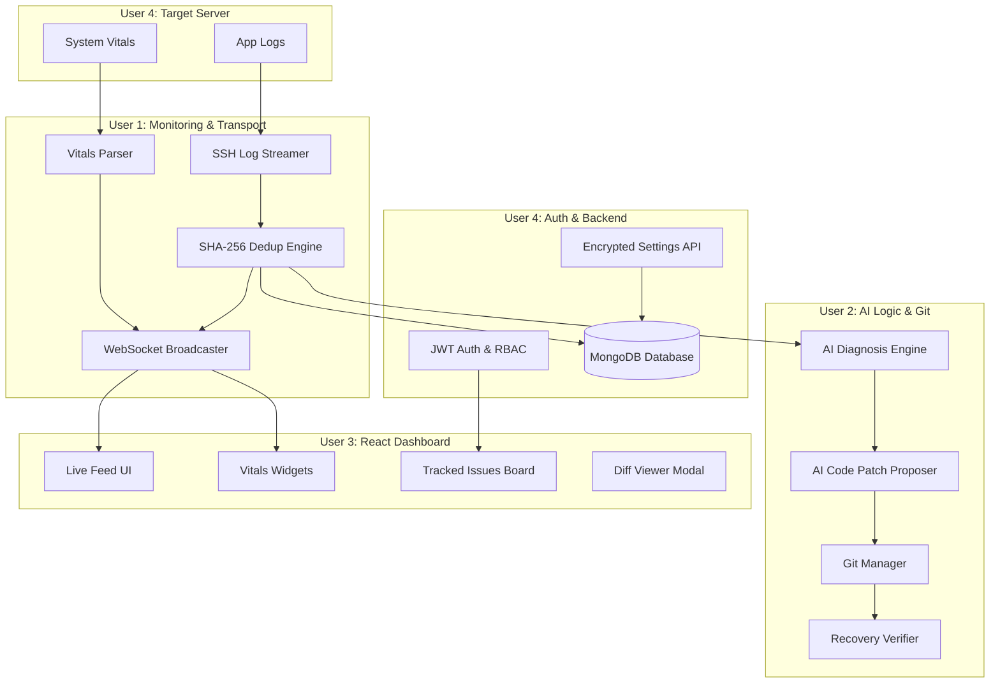

# FIXLY — AI-Powered Incident Detection & Self-Healing System
## System Architecture, Technical Specification & Project Plan

---

### Executive Summary

**Fixly** is an enterprise-grade, AI-driven autonomous incident detection and self-healing platform. Designed for modern cloud applications and remote server infrastructures, Fixly continuously monitors target server environments over secure SSH, ingests live application logs and system vitals (CPU, RAM, Disk), deduplicates repeated errors in real time, diagnoses root causes using Advanced Generative AI, and automatically generates, tests, and commits verified code fixes directly to Git repositories.

By combining real-time streaming WebSockets, intelligent SHA-256 error fingerprinting, automated Git branching, and a role-aware React + Tailwind CSS dashboard, Fixly reduces Mean Time to Detection (MTTD) and Mean Time to Resolution (MTTR) from hours down to seconds without human intervention.

---

## 1. System Vision & Core Capabilities

Fixly solves the critical enterprise challenge of operational downtime caused by application bugs and server resource degradation. 

### Key System Capabilities:
1. **Remote Log Streaming & Server Vitals Monitoring**: Key-based SSH monitoring reading server logs line-by-line and recording time-series CPU/RAM/Disk metrics.
2. **Real-Time Fingerprint Deduplication**: Instant error fingerprinting using normalized SHA-256 hashing to group identical exceptions into tracked incidents with incrementing counters.
3. **Generative AI Root-Cause Diagnosis**: Contextual error analysis calculating severity, root cause explanations, confidence scores, and fixability flags.
4. **Autonomous Git Self-Healing Pipeline**: Precise line-by-line unified code diff generation, automated feature branch creation, and GitHub/GitLab Pull Request pushing.
5. **Auto-Recovery Verification**: Post-patch continuous log monitoring that automatically verifies resolution when error fingerprints cease recurring.
6. **Live Role-Aware Control Dashboard**: Real-time WebSocket incident feed, vitals visualizer, code diff inspector, manual resolution controls, and masked token settings.

---

## 2. Technology Stack & Architecture Specs

| Layer | Technology | Rationale |
| :--- | :--- | :--- |
| **Language & Runtime** | **JavaScript (Node.js v20+)** | High asynchronous I/O performance, universal JavaScript stack across client & server. |
| **Frontend UI** | **React 18+ with Vite & Tailwind CSS** | Utility-first responsive design system, lightning-fast HMR, lightweight bundle size. |
| **Backend API** | **Express / Fastify** | Robust HTTP REST API router, native JSON handling, lightweight middleware pipeline. |
| **Real-Time Engine** | **WebSockets (`ws` / `socket.io`)** | Low-latency bi-directional event streaming for live feeds and metrics. |
| **Database & ODM** | **MongoDB with Mongoose ORM** | Schema validation, atomic document updates, and index acceleration. |
| **SSH Transport** | **`node-ssh` / `ssh2`** | Secure key-based remote log streaming and command execution. |
| **Version Control** | **`simple-git`** | Programmatic repository management, branch creation, diffing, and PR pushing. |
| **AI Integration** | **Groq Llama 3.3 (`llama-3.3-70b-versatile`) / Anthropic Claude / OpenAI** | High-speed LPU Llama 3.3 model for instant root-cause diagnosis and code patch diffs. |

---

## 3. System Modules & Workflows

Work is structured into 4 decoupled, parallel modules designed for multi-agent development:



### Module Breakdown:

#### Module 1: Server Connection & Monitoring (User 1)
- **SSH Transport (`ssh_client.js`)**: Authenticates via private key to remote server using `node-ssh`.
- **Log Streaming (`log_reader.js`)**: Tails `app.log` continuously and extracts stack traces.
- **Vitals Metrics (`vitals_reader.js`)**: Collects CPU %, Memory %, and Disk % every 5 seconds.
- **Deduplication Engine (`dedup_engine.js`)**: Strips dynamic IDs/timestamps, generates SHA-256 fingerprint hash. If existing, increments `occurrenceCount`; if new, creates `Incident`.
- **WS Broadcaster (`ws_broadcaster.js`)**: Pushes `incident:created`, `incident:updated`, and `vitals:updated` events over WebSocket.

#### Module 2: AI Logic & Version Control Integration (User 2)
- **AI Diagnosis (`diagnosis.js`)**: Evaluates raw log + stack trace context to produce severity, root cause explanation, confidence score, and fixability flag.
- **Code Fix Generator (`code_fixer.js`)**: Reads targeted application code file, invokes AI to generate fixed code snippet and line-by-line unified diff.
- **Git Manager (`git_client.js`)**: Creates branch `fix/inc-<id>` via `simple-git`, commits patch, and opens Pull Request via Git access token.
- **Recovery Verifier (`recovery.js`)**: Watches log stream for 5 minutes post-fix. If fingerprint zero-recurrence is confirmed, auto-resolves incident and emits `incident:resolved`.

#### Module 3: Interface & User Experience (User 3)
- **Live Feed (`LiveFeed.jsx`)**: Real-time updating list of active incidents styled with Tailwind CSS badges.
- **Server Vitals Widget (`ServerVitalsWidget.jsx`)**: Visual progress indicators for CPU, RAM, and Disk metrics.
- **Tracked Issues Kanban (`IssuesBoard.jsx`)**: Board listing OPEN, IN_PROGRESS, and RESOLVED issues.
- **Code Diff Inspector (`DiffViewer.jsx`)**: Modal showing line-by-line before/after code comparison.
- **Role-Aware Security UI**: Hides admin actions (settings, manual resolution) for read-only users based on RBAC token.

#### Module 4: Authentication, Settings & Target Harness (User 4)
- **Auth & RBAC (`auth_service.js`, `rbac_middleware.js`)**: User authentication issuing JWTs containing role claims (`ADMIN`, `OPERATOR`, `READ_ONLY`).
- **Backend Settings API (`settings_service.js`)**: Encrypted storage and masked retrieval (`ghp_****1234`) of repository tokens.
- **Shared Data Models (`src/models/`)**: Mongoose schemas for MongoDB collections (`users`, `incidents`, `monitored_servers`, `server_vitals`, `app_settings`, `audit_logs`).
- **Target Demo Harness (`target_environment/`)**: Target server containing reproducible error triggers.

---

## 4. End-to-End Execution Workflow

1. **Trigger**: An unhandled exception occurs on the target application server.
2. **Ingestion & Fingerprinting**: Module 1 reads the log line over SSH, strips dynamic parameters, and computes SHA-256 fingerprint.
3. **Deduplication Check**:
   - *If fingerprint exists*: Module 1 increments occurrence count in MongoDB and emits `incident:updated`.
   - *If new fingerprint*: Module 1 creates a new `OPEN` incident and emits `incident:created`.
4. **AI Diagnosis & Fix Generation**: Module 2 intercepts the new incident, runs AI root-cause analysis, generates a unified diff patch, creates a Git branch, pushes commit/PR, and emits `fix:proposed`.
5. **Dashboard Presentation**: Module 3 renders the new incident and diff patch instantly on the React + Tailwind CSS UI via WebSocket without browser refresh.
6. **Verification & Auto-Resolution**: Module 2 monitors target server logs for 5 minutes. Upon zero recurrences, status changes to `RESOLVED` and `incident:resolved` is emitted.

---

## 5. System Requirements & Non-Functional Specs

- **Latency**: Incident detection to WebSocket dashboard update < 500ms.
- **AI Processing Time**: Diagnosis & Git diff generation < 8 seconds.
- **Security**: Key-based SSH authentication, AES-256 encrypted access tokens in database, JWT HTTP Bearer authorization, role-based action gating.
- **Reliability**: Asynchronous I/O using Node.js and Mongoose driver; automatic SSH reconnection logic.
- **Extensibility**: Modular domain architecture allowing plug-and-play AI prompt models or alternative target server agents.

---

## 6. Project Roadmap & Branching Plan

Development is executed in parallel across 4 dedicated feature branches off `main`:

```
main (Phase 0: Shared Types & Mongoose Models pushed by User 4)
  ├── user-1/monitoring   (User 1: SSH, Log Reader, Dedup, WS Broadcaster)
  ├── user-2/ai-git       (User 2: AI Diagnosis, Code Fixer, GitPR, Recovery)
  ├── user-3/ui           (User 3: React + Tailwind CSS Dashboard, Live Feed, Diff Viewer)
  └── user-4/lead-auth    (User 4: Auth, Settings API, Demo Harness, E2E)
```

1. **Phase 0**: User 4 commits `src/common/types.js` and `src/models/` to `main`.
2. **Phase 1-3**: Users 1, 2, 3, and 4 develop their respective modules on dedicated feature branches.
3. **Phase 4.4**: End-to-End Verification of all error scenarios.
4. **Phase 4.5**: Final Merge of all feature branches into `main` and Hackathon Demo rehearsal.
