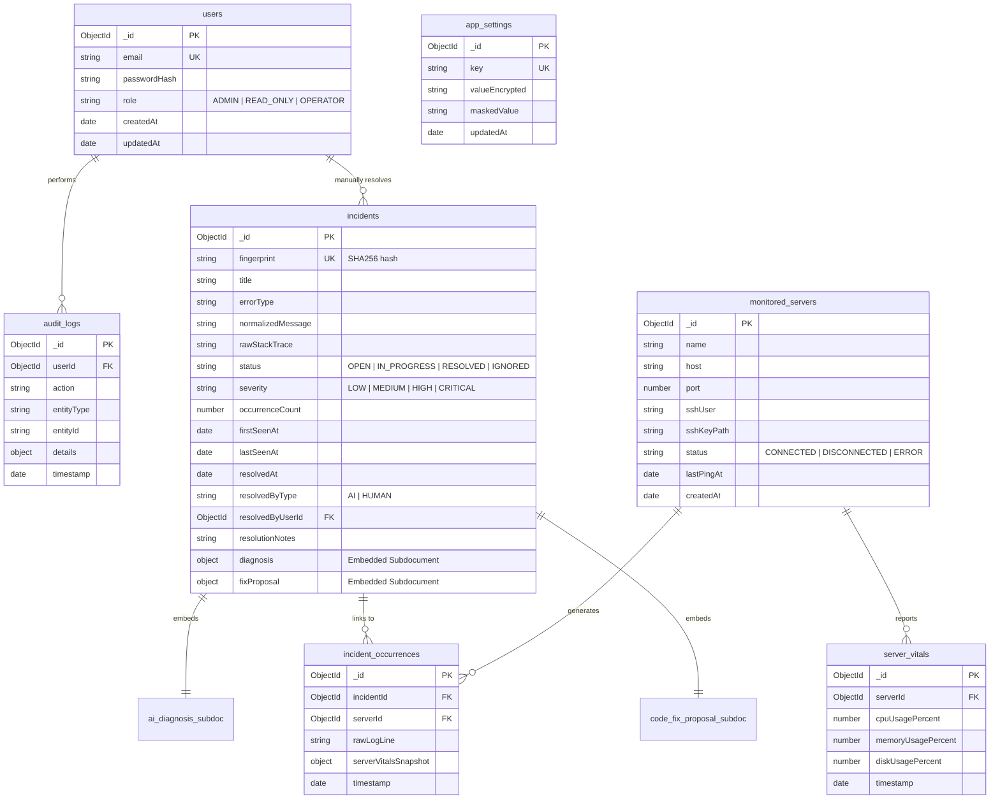

# Fixly — MongoDB Schema Specification (Mongoose JavaScript)

This document defines the complete document database schema for **Fixly**, tailored for **MongoDB** using **Mongoose ORM** in Node.js JavaScript. It details document modeling (embedding vs referencing), indexes, Mongoose schema definitions, and validation rules for multi-agent parallel development.

---

## Document Modeling Strategy

In MongoDB, data modeling balances document embedding (for atomic read/write efficiency) with referencing (for unbound growth prevention):

1. **Embedded Subdocuments**: 
   - `AI Diagnosis` and `Code Fix Proposal` are embedded directly inside the `Incident` document because an incident has a 1-to-1 relationship with its diagnosis and proposal. This allows fetching the full incident context in a single query without `$lookup` joins.
2. **Referenced Collections**:
   - `Occurrences` and `Server Vitals` are kept in separate collections (with time-based indexes or MongoDB Time-Series collections) to prevent `Incident` documents from exceeding the 16MB BSON limit during high error spikes.

---

## Entity Relationship & Collection Summary



---

## Detailed Collection Schemas & Mongoose JavaScript Definitions

### 1. `users` Collection (User 4 / Auth)
Stores system users and authentication details.

#### Mongoose Schema Definition (`src/models/User.js`)
```javascript
const mongoose = require('mongoose');

const UserSchema = new mongoose.Schema({
  email: { type: String, required: true, unique: true, lowercase: true, trim: true, index: true },
  passwordHash: { type: String, required: true },
  role: { type: String, enum: ['ADMIN', 'READ_ONLY', 'OPERATOR'], default: 'OPERATOR', required: true }
}, { timestamps: true });

module.exports = mongoose.model('User', UserSchema);
```

---

### 2. `monitored_servers` Collection (User 1 / Monitoring)
Configured target servers accessed over SSH.

#### Mongoose Schema Definition (`src/models/MonitoredServer.js`)
```javascript
const mongoose = require('mongoose');

const MonitoredServerSchema = new mongoose.Schema({
  name: { type: String, required: true },
  host: { type: String, required: true },
  port: { type: Number, default: 22, required: true },
  sshUser: { type: String, required: true },
  sshKeyPath: { type: String, required: true },
  status: { type: String, enum: ['CONNECTED', 'DISCONNECTED', 'ERROR'], default: 'DISCONNECTED' },
  lastPingAt: { type: Date }
}, { timestamps: true });

module.exports = mongoose.model('MonitoredServer', MonitoredServerSchema);
```

---

### 3. `incidents` Collection (User 1 & User 2 Core Document)
Deduplicated issues with embedded AI diagnoses and code fix proposals.

#### Mongoose Schema Definition (`src/models/Incident.js`)
```javascript
const mongoose = require('mongoose');

const AIDiagnosisSubSchema = new mongoose.Schema({
  severity: { type: String, enum: ['LOW', 'MEDIUM', 'HIGH', 'CRITICAL'], required: true },
  rootCause: { type: String, required: true },
  confidenceScore: { type: Number, required: true, min: 0, max: 1 },
  automatableFixExists: { type: Boolean, required: true, default: false },
  metadata: { type: mongoose.Schema.Types.Mixed, default: {} },
  createdAt: { type: Date, default: Date.now }
}, { _id: false });

const CodeFixProposalSubSchema = new mongoose.Schema({
  targetFilePath: { type: String, required: true },
  originalCodeSnippet: { type: String, required: true },
  proposedCodeSnippet: { type: String, required: true },
  diffPatch: { type: String, required: true },
  gitBranchName: { type: String, required: true },
  gitCommitSha: { type: String },
  pullRequestUrl: { type: String },
  status: { type: String, enum: ['PENDING', 'APPLIED', 'REJECTED', 'VERIFIED'], default: 'PENDING' },
  createdAt: { type: Date, default: Date.now },
  appliedAt: { type: Date }
}, { _id: false });

const IncidentSchema = new mongoose.Schema({
  fingerprint: { type: String, required: true, unique: true, index: true },
  title: { type: String, required: true },
  errorType: { type: String, required: true },
  normalizedMessage: { type: String, required: true },
  rawStackTrace: { type: String },
  status: { type: String, enum: ['OPEN', 'IN_PROGRESS', 'RESOLVED', 'IGNORED'], default: 'OPEN', index: true },
  severity: { type: String, enum: ['LOW', 'MEDIUM', 'HIGH', 'CRITICAL'], default: 'MEDIUM' },
  occurrenceCount: { type: Number, default: 1, required: true },
  firstSeenAt: { type: Date, default: Date.now },
  lastSeenAt: { type: Date, default: Date.now, index: true },
  resolvedAt: { type: Date },
  resolvedByType: { type: String, enum: ['AI', 'HUMAN'] },
  resolvedByUserId: { type: mongoose.Schema.Types.ObjectId, ref: 'User' },
  resolutionNotes: { type: String },
  diagnosis: { type: AIDiagnosisSubSchema },
  fixProposal: { type: CodeFixProposalSubSchema }
}, { timestamps: true });

IncidentSchema.index({ status: 1, lastSeenAt: -1 });

module.exports = mongoose.model('Incident', IncidentSchema);
```

---

### 4. `incident_occurrences` Collection (User 1 / Log Streaming)
Individual raw log hits associated with an incident.

#### Mongoose Schema Definition (`src/models/IncidentOccurrence.js`)
```javascript
const mongoose = require('mongoose');

const IncidentOccurrenceSchema = new mongoose.Schema({
  incidentId: { type: mongoose.Schema.Types.ObjectId, ref: 'Incident', required: true, index: true },
  serverId: { type: mongoose.Schema.Types.ObjectId, ref: 'MonitoredServer' },
  rawLogLine: { type: String, required: true },
  serverVitalsSnapshot: {
    cpuUsagePercent: Number,
    memoryUsagePercent: Number,
    diskUsagePercent: Number
  },
  timestamp: { type: Date, default: Date.now, index: true }
});

IncidentOccurrenceSchema.index({ incidentId: 1, timestamp: -1 });

module.exports = mongoose.model('IncidentOccurrence', IncidentOccurrenceSchema);
```

---

### 5. `server_vitals` Collection (User 1 / Time-Series)
Time-series metrics recorded periodically from monitored target servers.

#### Mongoose Schema Definition (`src/models/ServerVitals.js`)
```javascript
const mongoose = require('mongoose');

const ServerVitalsSchema = new mongoose.Schema({
  serverId: { type: mongoose.Schema.Types.ObjectId, ref: 'MonitoredServer', required: true },
  cpuUsagePercent: { type: Number, required: true },
  memoryUsagePercent: { type: Number, required: true },
  diskUsagePercent: { type: Number, required: true },
  timestamp: { type: Date, default: Date.now, index: true }
});

ServerVitalsSchema.index({ timestamp: 1 }, { expireAfterSeconds: 604800 });

module.exports = mongoose.model('ServerVitals', ServerVitalsSchema);
```

---

### 6. `app_settings` Collection (User 3 & 4 / System Admin)
System configuration key-value storage.

#### Mongoose Schema Definition (`src/models/AppSetting.js`)
```javascript
const mongoose = require('mongoose');

const AppSettingSchema = new mongoose.Schema({
  key: { type: String, required: true, unique: true, index: true },
  valueEncrypted: { type: String, required: true },
  maskedValue: { type: String, required: true }
}, { timestamps: true });

module.exports = mongoose.model('AppSetting', AppSettingSchema);
```

---

### 7. `audit_logs` Collection (User 4 / Auditing)
Audit trail of actions executed by human users or AI services.

#### Mongoose Schema Definition (`src/models/AuditLog.js`)
```javascript
const mongoose = require('mongoose');

const AuditLogSchema = new mongoose.Schema({
  userId: { type: mongoose.Schema.Types.ObjectId, ref: 'User' },
  action: { type: String, required: true, index: true },
  entityType: { type: String, required: true },
  entityId: { type: String, required: true },
  details: { type: mongoose.Schema.Types.Mixed, default: {} },
  timestamp: { type: Date, default: Date.now, index: true }
});

module.exports = mongoose.model('AuditLog', AuditLogSchema);
```
